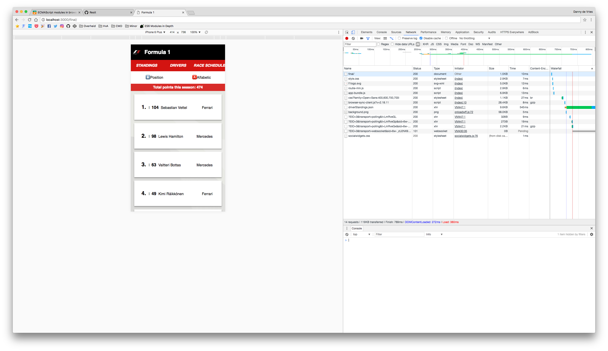
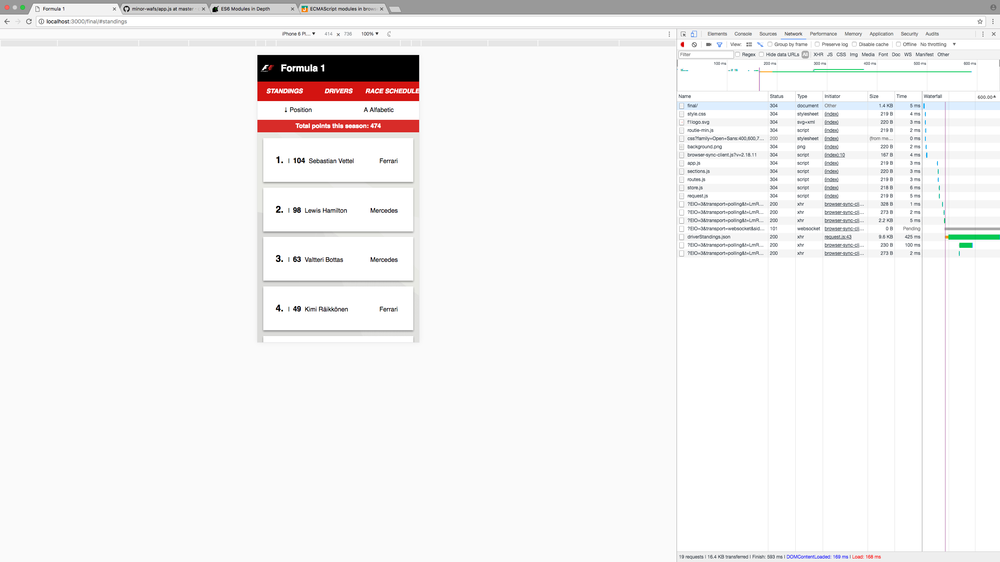

# minor-wafs resit

To finish this course I had to complement the following requirements:
* Code is modular: Use modules and Object Literals
* Data is manipulated using `filter/sort/map/reduce`

**Below is a changelog:**

## Data manipulation
I needed to manipulate the data coming from the API. I've first played around with small portions of the code to `.filter` the driver standings to only the top ten.

Then I tried using all of the *methods* and combine to add some useful functionality. I wanted to show the total points this season.
* With `.map` I return only the points of a driver.
* Convert the string coming from the API with `Number`
* `.filter` out the points below 0
* Used `.reduce` to make a sum of all the driver points

```
data
  .map(function(driver) {
    return driver.points;
  })
  .filter(function(points) {
    return points > 25;
  })
  .reduce(function(total, points) {
    return total + points;
  });
```
`.filter` : Creates a new array with all elements that pass the provided function.  
 `.reduce` : Reduce data to a single value against an accumulator.  
 `.map` : Creates a new array with the results of calling a provided function on every element.

 ## modules
 Based on the articles of [Jake Archibald](https://jakearchibald.com/2017/es-modules-in-browsers/) and [Ponyfoo](https://ponyfoo.com/articles/es6-modules-in-depth) I made modules of my code using the new ECMAScript modules which are starting to land in browsers.

 *Tested in `Chrome Canary 60` behind the Experimental Web Platform flag in `chrome:flags`*

Some caveats:
* When opening the file locally you get a `cross-origin` warning and the modules fail to load. I've used browser-sync to bypass this.
* To create a fallback I've used the `nomodule` attribute and load in `app-bundle.js`.

**Sreenshots**


