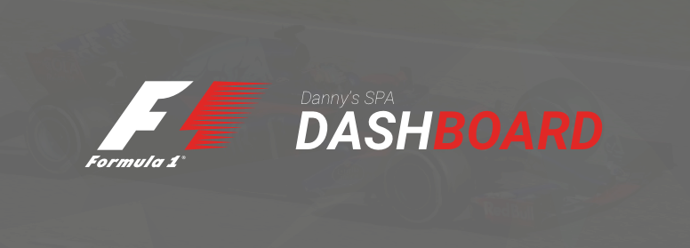
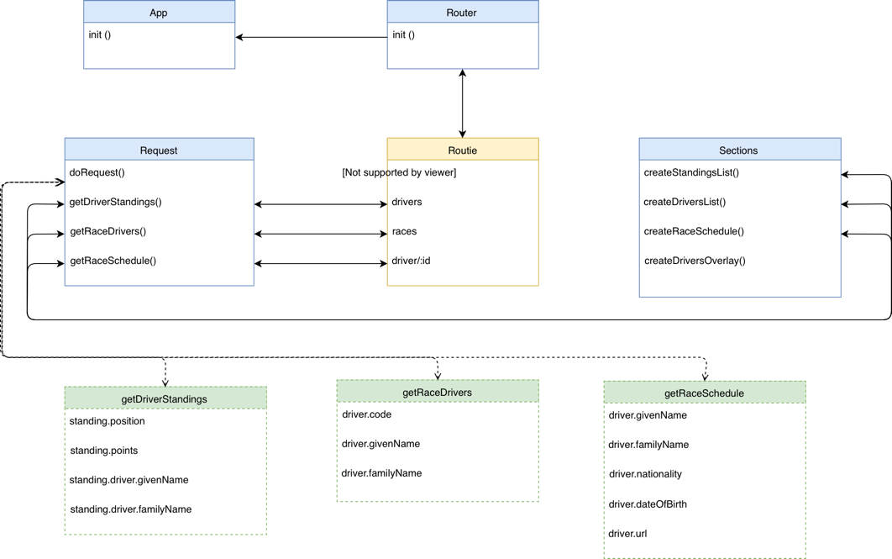

# Formula 1 - Dashboard 🏎
---

[Live version](https://dandevri.github.io/minor-wafs/final/) | [Code](https://github.com/dandevri/minor-wafs/tree/master/final/static)

## Introduction
Hello outsider,

This **Formula 1 Dashboard SPA** shows you the the latest statistics about:
* Driver standings
* Drivers
* Race schedule

The upcoming Formula 1 season (2017) is right around the corner. To give race fanatics and Max Verstappen fans insight in the upcoming season is why I build this app. Through the menu you can navigate to the different sections with every page showing different statistics. You can even sort race drivers by name.

## Terminology:
* Driver: The person that drives the Formula 1 car.
* Constructor: The Team a driver races for. (The constructor maintains the car)
* Grand Prix: A race containing `x`laps of a track. The winner wins the trophy for that Grand Prix.

## Resources

**API used**: [Ergast Formula 1 - API](http://ergast.com/mrd/) 
**Styling inspiration**:  [Formula 1 Website](http://formula1.com)

## Wishlist and TODO's

- [ ] Add more filter and sort options
- [ ] Refactor the API request
- [ ] Make the list remove prettier
- [ ] Maybe replace innerHTML with insertAdjacentHTML

## Flow

**Actor Diagram**

---

**User Flow**

## License
The content of this project itself is licensed under the Creative Commons Attribution 3.0 license, and the underlying source code used to format and display that content is licensed under the MIT license.
